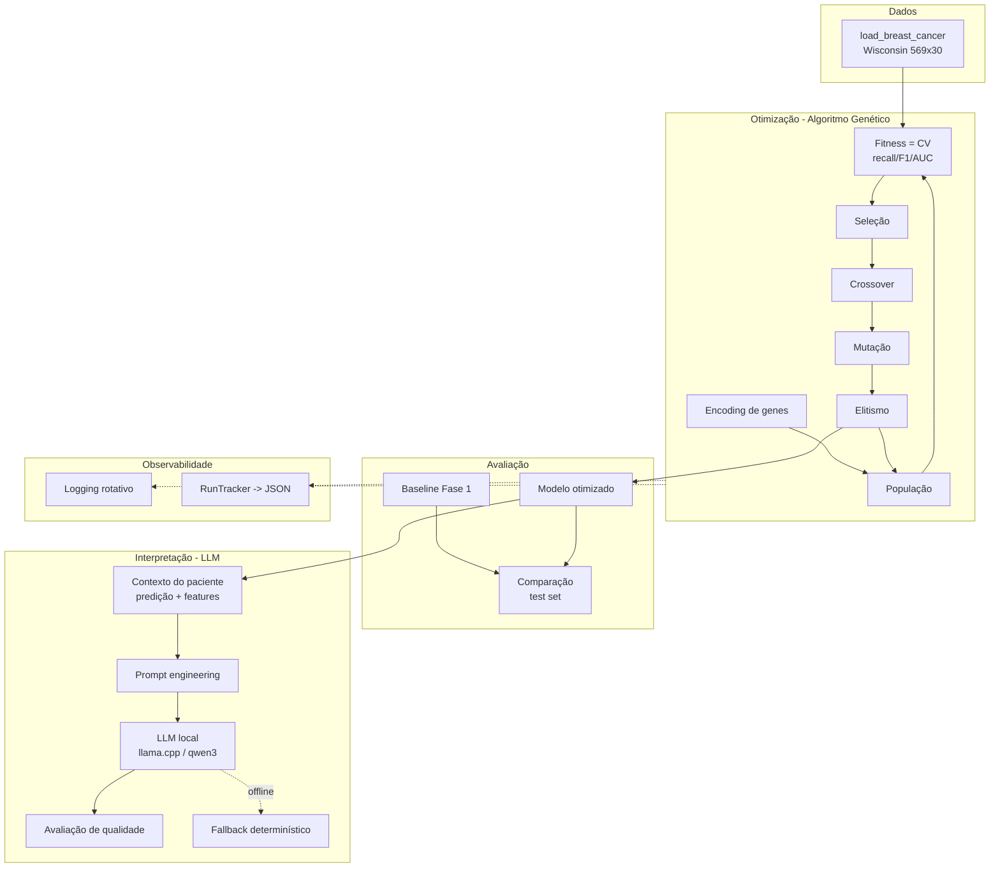

# Arquitetura da Solução — Fase 2

> Sistema de otimização de modelos de diagnóstico via Algoritmo Genético, com
> interpretação clínica por LLM local. Continuação do Tech Challenge Fase 1.

Este documento atende diretamente ao requisito *"Documentar arquitetura e
decisões de implementação"* e às lacunas apontadas no feedback da Fase 1
(descrição de arquitetura e considerações de segurança/produção).

---

## 1. Visão geral

O sistema é organizado em camadas desacopladas, seguindo princípios de Clean
Architecture — o domínio (GA, fitness, avaliação) não conhece detalhes de
infraestrutura (LLM, logging, nuvem):

---

## 2. Componentes (mapa para o código)

| Camada | Módulo | Responsabilidade |
|--------|--------|------------------|
| Dados | `diag_opt/data.py` | Carga do dataset e split estratificado |
| Modelos | `diag_opt/models.py` | Factory de estimadores, baselines e **codificação de genes** |
| GA — genes | `diag_opt/ga/encoding.py` | Representação e amostragem de indivíduos |
| GA — operadores | `diag_opt/ga/operators.py` | Seleção, crossover, mutação |
| GA — fitness | `diag_opt/ga/fitness.py` | Avaliação por validação cruzada + cache |
| GA — motor | `diag_opt/ga/engine.py` | Loop geracional com elitismo e histórico |
| Avaliação | `diag_opt/evaluation.py` | Métricas no test set, baseline vs otimizado |
| Experimentos | `diag_opt/experiments.py` | 5 configurações de GA e execução |
| LLM — cliente | `diag_opt/llm/client.py` | Acesso ao LLM local (OpenAI-compat) |
| LLM — prompts | `diag_opt/llm/prompts.py` | Prompt engineering clínico |
| LLM — interpretação | `diag_opt/llm/interpreter.py` | Contexto do paciente + texto (com fallback) |
| LLM — qualidade | `diag_opt/llm/quality.py` | Avaliação objetiva das interpretações |
| Observabilidade | `diag_opt/monitoring/*` | Logging e tracking de execuções |
| Interface | `diag_opt/cli.py` | CLI (optimize / experiments / interpret) |

---

## 3. Decisões de implementação

1. **Representação fenotípica dos genes** (`{hiperparâmetro: valor}`) em vez de
   binária: legível, mapeia 1:1 com o modelo e simplifica os operadores.
2. **Fitness por validação cruzada estratificada**, não por um único holdout —
   evita que o GA sobreajuste a uma partição. O `test set` fica reservado apenas
   para a comparação final baseline vs otimizado (sem vazamento).
3. **Recall da classe maligna como métrica dominante** (peso 0,6): coerência
   clínica com a Fase 1 — falso negativo é o erro mais grave.
4. **Cache de fitness**: combinações repetidas de hiperparâmetros não são
   reavaliadas, reduzindo drasticamente o custo computacional.
5. **LLM local por padrão** (llama.cpp + Qwen3 4B Instruct, `Qwen3-4B-Instruct-2507-Q4_K_M.gguf`): privacidade dos dados do paciente
   (nenhum dado sai da rede local) e custo zero de API. O endpoint é
   configurável por variável de ambiente para qualquer servidor OpenAI-compat.
6. **Fallback determinístico** na interpretação: garante que demonstração,
   testes e CI funcionem mesmo sem o LLM no ar.

---

## 4. Escalabilidade e produção

Ver [escalabilidade.md](escalabilidade.md) e [seguranca.md](seguranca.md).
