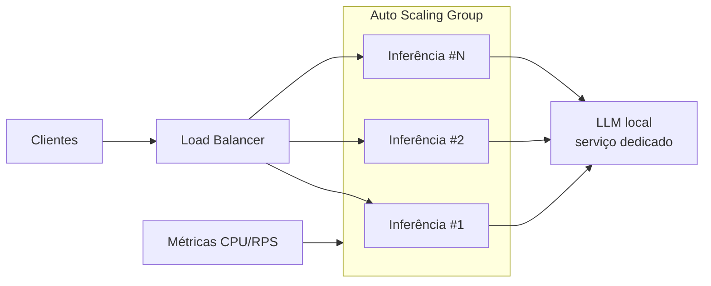

# Escalabilidade, Monitoramento e Produção

Atende ao requisito *"Configurar recursos de escalabilidade automática para
lidar com variações de demanda"* e *"Implementar monitoramento e logging
adequados para tracking de desempenho"*.

## 1. Dois perfis de carga, duas estratégias

O sistema tem dois tipos de workload muito diferentes:

| Workload | Característica | Estratégia de escala |
|----------|---------------|----------------------|
| **Otimização (GA)** | Batch, intensivo em CPU, esporádico (retreino) | Job efêmero / paralelização por `n_jobs` e por indivíduo |
| **Inferência + interpretação** | Online, latência sensível, demanda variável | Serviço com **auto-scaling horizontal** por métrica |

## 2. Escalabilidade da otimização (GA)

- **Paralelismo intra-fitness**: cada avaliação usa `n_jobs=-1` na validação
  cruzada do scikit-learn.
- **Cache de fitness**: elimina reavaliações de cromossomos repetidos — em nossos
  experimentos, 99–156 avaliações efetivas para populações que gerariam
  200–400 combinações.
- **Paralelização populacional** (evolução natural): a avaliação dos indivíduos
  de uma geração é *embarrassingly parallel* — pode ser distribuída via
  `joblib`/Ray/Dask ou como jobs paralelos no cluster.

## 3. Escalabilidade da inferência

O serviço de inferência é *stateless* (o modelo é carregado do artefato), o que
permite escala horizontal trivial. Na nuvem (ver [`infra/`](../infra)):

- **Auto-scaling** por CPU e por número de requisições (target tracking).
- **Health checks** e *rolling deploys*.
- O LLM local roda como um *sidecar*/serviço dedicado com sua própria política de
  escala (GPU/CPU), desacoplado do serviço de ML.

## 4. Monitoramento e logging

- **Logging estruturado** (`monitoring/logging_config.py`): console (INFO) +
  arquivo rotativo (DEBUG) em `results/logs`.
- **Tracking de execuções** (`monitoring/tracker.py`): cada run do GA gera um
  JSON com configuração, histórico de convergência por geração e métricas finais.
- **Métricas recomendadas em produção** (para dashboards/alertas):
  - ML: latência de inferência (p50/p95), taxa de requisições, distribuição das
    predições e **monitoramento de *data drift*** (alerta se a distribuição das
    features divergir do treino);
  - LLM: latência de geração, taxa de *fallback*, score médio de qualidade das
    interpretações;
  - GA (retreino): melhor fitness por geração, tempo por experimento.

## 5. Estratégia de retreino

Retreino disparado por: (a) agenda periódica, (b) chegada de novo volume de
dados rotulados, ou (c) alerta de *drift*. O GA roda como job de otimização;
o melhor modelo é versionado como artefato e promovido ao serviço de inferência
após validação (recall no conjunto de validação ≥ modelo em produção).
